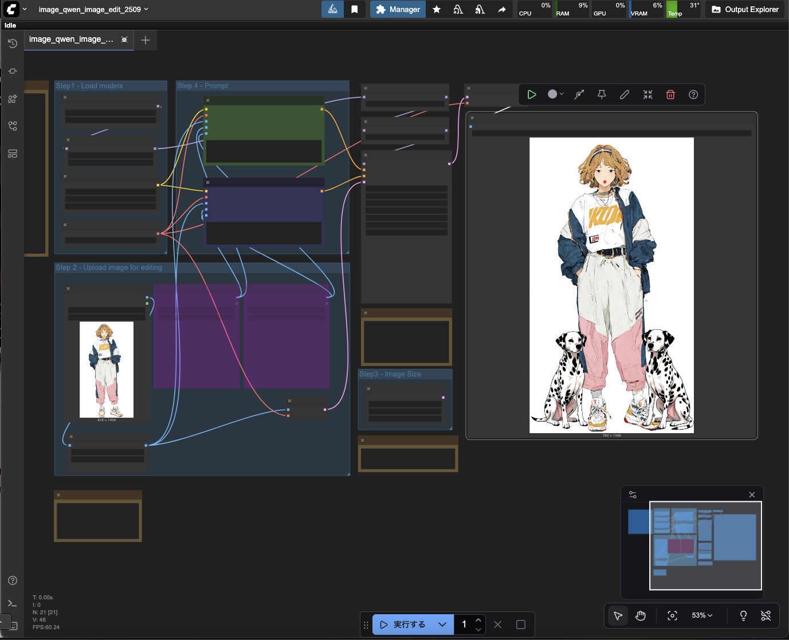

# Comfy UI

## clone

```bash
git clone https://github.com/hndrr/modal-comfyui.git
cd modal-comfyui
uv sync
```

## launch

```bash
uv run modal serve comfyapp.py
```



## model upload

```bash
uv run modal run preserve-model.py::preserve_model \
  --repo-id "Comfy-Org/Qwen-Image_ComfyUI" \
  --filename "split_files/text_encoders/qwen_2.5_vl_7b_fp8_scaled.safetensors" \
  --revision "main" \
  --destination-subdir "text_encoders"
```

### Gradio UI

```bash
uv run preserve_model_gui.py
```
