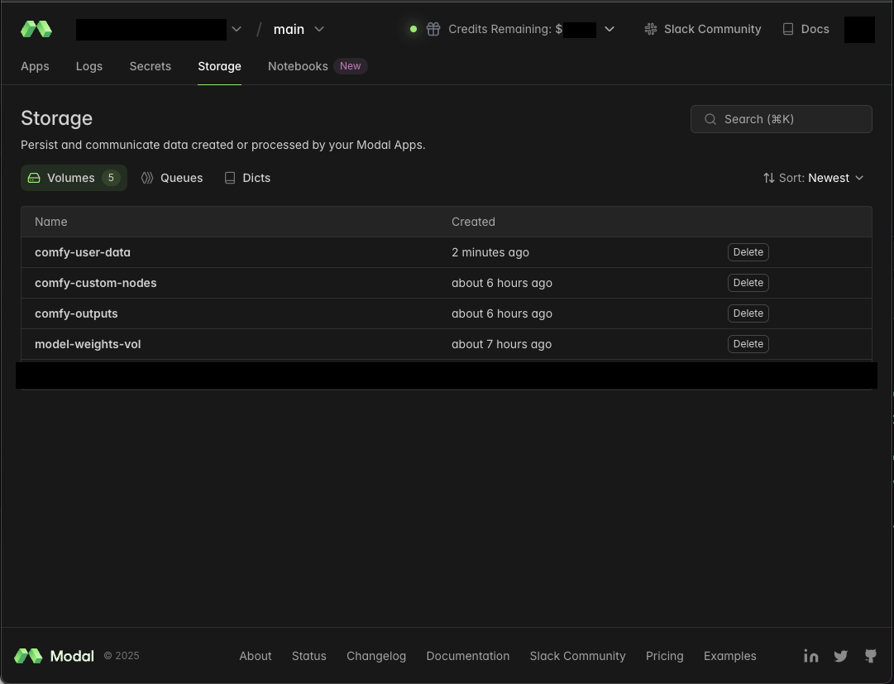
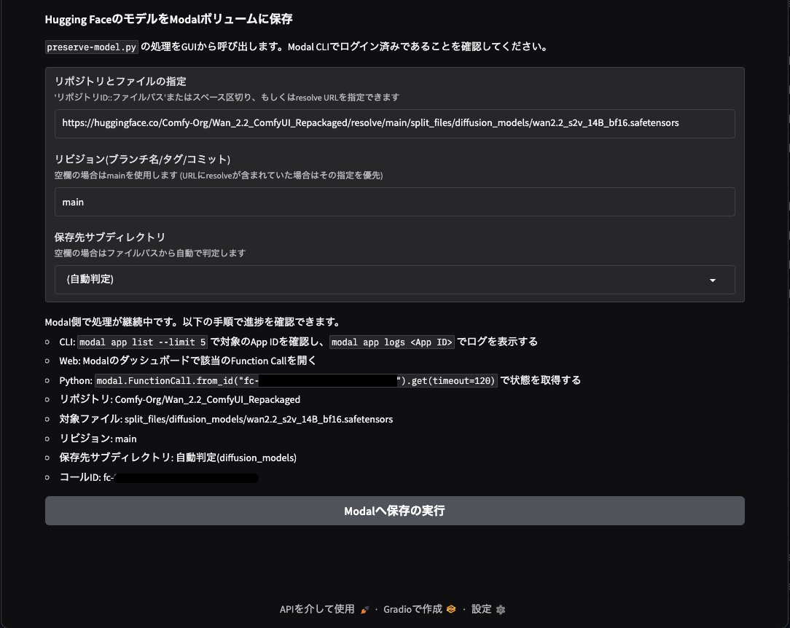

# [WIP] Modal ComfyUI deploy

## clone

```bash
git clone https://github.com/hndrr/modal-comfyui-deploy.git
cd modal-comfyui-deploy
uv sync
```

## launch

```bash
uv run modal serve comfyapp.py
```


### GPU とコンテナ設定

- `comfyapp.py` 内の `@app.function` で `gpu="T4"` など Modal が提供する GPU 名を指定します。CPU のみで動かす場合は `gpu=None` にします。
- 2025年9月時点で指定できる主な GPU 名は
   `T4`、`L4`、`A10`、`A100`、`A100-40GB`、`A100-80GB`、`L40S`、`H100`、`H200`、`B200`
   です。
   需要に合わせて `gpu="A100-80GB"` などと書き換えてください。
- 複数 GPU を 1 コンテナに割り当てたい場合は `gpu="H100:4"` のように末尾へ `:台数` を付与します。B200/H200/H100/A100/L40S/L4/T4 は最大 8 台、A10 は最大 4 台まで指定できます。
- GPU を複数候補で指定して可用性を高めたい場合は `gpu=["H100", "A100-40GB:2"]` のようにリストで渡すと優先順位付きフォールバックが機能します。
- 料金は GPU 種類ごとに異なるため、[Modal の料金ページ](https://modal.com/pricing)で最新の秒課金単価を確認してください。例: `H100` は 1秒あたり約 $0.001097。
- 同時実行数を増やしたい場合は `max_containers` を調整します。値を大きくすると並列に立ち上がる GPU コンテナが増え、利用料金も比例して増えます。
- 長時間の推論が必要な場合は `timeout` や `scaledown_window` を大きめに設定し、セッションが途中で停止しないようにします。
- 常時稼働させる際は `modal deploy comfyapp.py` を利用して常駐サービスとして公開できます。

## model upload



```bash
uv run modal run preserve_model.py::preserve_model \
  --repo-id "Comfy-Org/Qwen-Image_ComfyUI" \
  --filename "split_files/text_encoders/qwen_2.5_vl_7b_fp8_scaled.safetensors" \
  --revision "main" \
  --destination-subdir "text_encoders"
```

### preserve_model をデプロイして遠隔実行する

1. `uv run modal deploy preserve_model.py --name preserve-model`
   - `preserve_model.py` 内で定義している `modal.App("preserve-model")` と CLI のデプロイ名を一致させます。
2. デプロイ済み関数は Python から呼び出します。ワンライナーの例:
   - `remote` は非同期実行を開始し、戻り値で保存先パスとファイルサイズを確認できます。

```bash
   uv run python - <<'PY'
   import modal
   f = modal.Function.from_name("preserve-model", "preserve_model")
   result = f.remote(
       repo_id="Comfy-Org/Qwen-Image-Edit_ComfyUI",
       filename="split_files/diffusion_models/qwen_image_edit_2509_bf16.safetensors",
       revision="main",
       destination_subdir="diffusion_models",
   )
   print(result)
   PY
```

3. 実行ログは `uv run modal app logs preserve-model --tail` で追跡できます。長時間監視する場合は `--tail` を外して `--since` などを指定してください。

### Gradio UI

デフォルト (ローカルでmodal.App.run()を使う一時コンテナ起動):

```bash
uv run preserve_model_gui.py
```

デプロイ済み関数を利用する場合 (既定のアプリ名/関数名を使用):

```bash
uv run preserve_model_gui.py --use-deployed
```

- デプロイ名や関数名を変えている場合は `--deployed-app-name` / `--deployed-function-name` で上書きします。
- ローカル起動を明示したい場合は `--use-local` を付けても同じ結果になります。
- 共有URLやポート設定を行いたい場合は `--share`、`--server-port`、`--server-name` オプションを組み合わせてください。

open:  <http://127.0.0.1:7860>



## volume copy

`rename_volume.py` は Modal の Volume リソース同士で中身をコピーし、実質的にボリューム名を移行するためのユーティリティです。コピー先が存在しない場合は自動で作成されます。

```bash
uv run python rename_volume.py <コピー元ボリューム名> <コピー先ボリューム名>
```

- 実行すると確認プロンプトが表示されます。CI などで確認を省略したい場合は `--yes` オプションを付けてください。
- コピー完了後は Modal ダッシュボードや `modal volume list` で内容を確認してください。
- 問題がなければ旧ボリュームを `modal volume delete <コピー元ボリューム名>` で削除できます。
